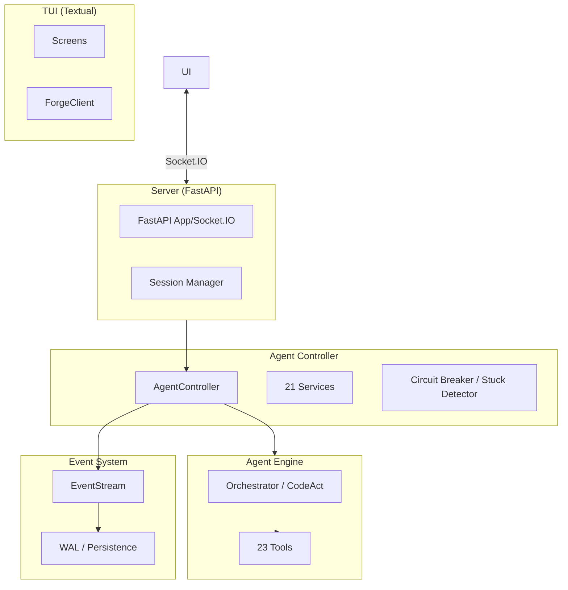

# Forge

[](LICENSE)
[](https://python.org)
[](https://mypy-lang.org/)
[](https://github.com/psf/black)

**Forge** is a high-performance, open-source AI coding platform built for deep, autonomous coding sessions.
It pairs a **Textual TUI** with a **FastAPI + Socket.IO** backend, shipping with
event-sourced session resilience, 12 context condensers, and a 23-tool agent engine.

---

## Why Forge?

- **Built for Scale:** Handles thousands of events per session with an event-sourced backbone.
- **Resilient by Design:** Write-Ahead Logging (WAL) and backpressure-aware streams ensure zero event loss, even on process crashes.
- **Expert Memory:** 12 distinct [context condenser](docs/CONDENSERS.md) strategies (Smart, Semantic, LLM, etc.) and an auto-selector pick the right memory for every task.
- **Safety First:** Multi-trip circuit breakers, 6-strategy stuck detection, and per-task cost caps keep your budget and system safe.
- **Local-First:** Native Ollama and OpenAI-compatible support for zero-cost, private coding.
- **No-Node TUI:** A full-featured terminal interface built entirely in Python (Textual) — zero JavaScript required.

---

## 🏗️ Architecture



See the [Architecture Deep Dive](docs/ARCHITECTURE.md) for a full walkthrough of the 21 services and 23 tools.

---

## 🚀 Quick Start

### 🐳 Docker (Recommended)
Run the helper script to setup config and launch:
```bash
./docker_start.sh   # Linux/macOS
# or
.\DOCKER_START.ps1  # Windows
```

### 🪟 Windows (Local)
Run the bootstrap script at the repository root. It installs dependencies, sets up the environment, and starts the app:

```powershell
.\START_HERE.ps1
```

### 🐧 Linux / macOS / Manual
1. **Prerequisites:** Python 3.12+ and [uv](https://docs.astral.sh/uv/).
2. **Install:** `uv sync`
3. **Setup Config:** `cp config.template.toml config.toml`
4. **Start Backend:** `uv run python start_server.py`
5. **Start TUI:** `uv run forge-tui`

---

## 🤖 LLM Support

Forge features an **Intelligent Provider Resolver** that handles routing, local discovery, and model aliases automatically.

### Cloud Models
Configure in `config.toml`. Forge auto-resolves providers (OpenAI, Anthropic, Gemini, etc.):
- **Anthropic**: `claude-3-7-sonnet` (Native SDK, no prefix needed)
- **OpenAI**: `gpt-4o`, `gpt-4o-mini`
- **Google**: `gemini-2.0-pro-exp`

### Local Models & Auto-Discovery
Forge automatically discovers running local providers (Ollama, LM Studio, vLLM):
1. Start your local provider (e.g., `ollama serve`).
2. Set `model = "ollama/llama3.2"` (or `lmstudio/...`) in `config.toml`.
3. Forge probes localhost ports (:11434, :1234, :8000) and routes locally with ZERO manual configuration.

### Model Aliases
Define semantic aliases in `config.toml` to swap models without changing code:
```toml
[model_aliases]
coding = "claude-3-7-sonnet"
fast = "gpt-4o-mini"
local = "ollama/qwen2.5-coder"
```
Then use `model = "coding"` in your config or agent settings.

---

## 🛠️ Key Concepts

### 12 Context Condensers
Stop running out of tokens. Forge uses specialized "condensers" to compress conversation history:
- **Smart/Auto**: Dynamically switches strategies based on task signals.
- **LLM Summary**: Uses a cheaper model to intelligently summarize history.
- **Observation Masking**: Keeps the event structure but hides bulky command outputs.
- **Semantic**: Uses embeddings to find and keep relevant past interactions.

### 23 Specialized Tools
From `str_replace_editor` (tree-sitter aware) to `browser` automation and `database` access, the agent has everything it needs to build complex apps.

### 6-Strategy Stuck Detection
Forge detects if the agent is looping by analyzing action patterns, semantic intent, cost acceleration, and token repetition. The circuit breaker then safely pauses the agent for your review.

---

## 📖 Documentation

- [User Guide](docs/USER_GUIDE.md) — LLM setup, autonomy modes, playbooks, and TUI usage.
- [Architecture](docs/ARCHITECTURE.md) — Deeper dive into the controller, events, and engine layers.
- [Developer Guide](docs/DEVELOPER.md) — For contributors: project layout, internals, and patterns.
- [API Reference](openapi.json) — Full OpenAPI 3.1 spec for the backend.
- [Contributing](CONTRIBUTING.md) — How to add new tools, condensers, or features.

---

## 🤝 Contributing

We welcome contributions! See [CONTRIBUTING.md](CONTRIBUTING.md) for setup instructions and our architecture-first development workflow.

---

## ⚖️ License

MIT — See [LICENSE](LICENSE).
