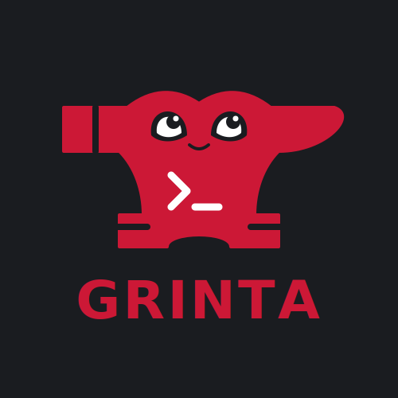
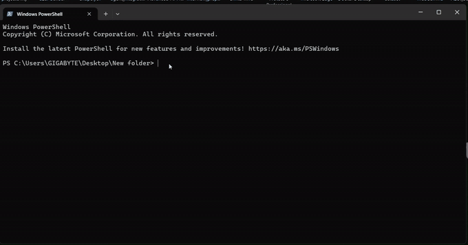
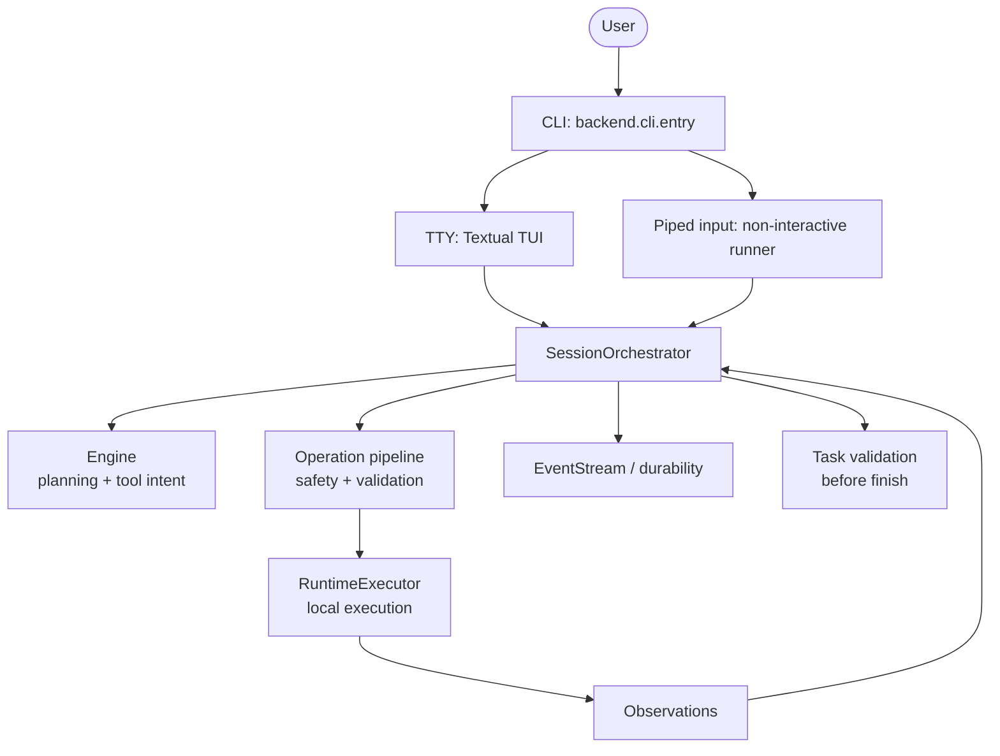

# Grinta



[](LICENSE)
[](https://python.org)
[](docs/INSTALL.md)
[](https://mypy-lang.org/)
[](https://github.com/astral-sh/ruff)
[](https://github.com/josephsenior/Grinta-Coding-Agent/actions/workflows/py-tests.yml)
[](https://github.com/josephsenior/Grinta-Coding-Agent/actions/workflows/lint.yml)
[](https://github.com/josephsenior/Grinta-Coding-Agent/actions/workflows/e2e-tests.yml)
[](https://github.com/josephsenior/Grinta-Coding-Agent/releases/tag/v1.0.0-rc1)

> **Local-first. Provider-agnostic. Ships with real LSP + DAP. Optional extras stay opt-in.**
>
> A terminal coding agent that plans, executes, validates, and finishes — without a cloud control plane, without lock-in to one model vendor, and without the old heavyweight install footprint.
>
> **Current status:** `v1.0.0-rc1` public release candidate. Linux, Windows, and macOS run required unit and extended CI gates; smoke-install and onboarding validation are in place. Remaining GA work is mostly documentation alignment, contributor-doc honesty, and edge-case hardening after the post-rc1 decomposition wave.

### Grinta in action



Direct link if the animation does not load: [`docs/assets/grinta-demo.gif`](docs/assets/grinta-demo.gif).

## Release status

- Latest public build is `v1.0.0-rc1` (release candidate), not final GA.
- Required CI covers sharded Linux unit coverage (75%), cross-platform unit gates, and integration/e2e/stress on Linux, Windows, and macOS; smoke-install and onboarding validation are in place for the current release line.
- We are actively collecting feedback on UX clarity and edge-case reliability before the GA call.
- Linux, Windows, and macOS are supported release targets, but certification depth differs by platform; see [docs/SUPPORT_MATRIX.md](docs/SUPPORT_MATRIX.md).
- If you hit friction, please open an issue with the `RC Feedback` template from the issue chooser.
- GA criteria and release gate details live in [docs/RELEASE_CHECKLIST.md](docs/RELEASE_CHECKLIST.md).

## Why Grinta vs the rest

|                                                                                   | **Grinta**          | Aider   | Claude Code       | Codex CLI      |
| --------------------------------------------------------------------------------- | ------------------- | ------- | ----------------- | -------------- |
| Provider-agnostic (OpenAI / Anthropic / Google / Ollama / LM Studio / OpenRouter) | ✅                  | ✅      | ❌ Anthropic only | ❌ OpenAI only |
| Local-first (works fully offline w/ Ollama)                                       | ✅ auto-detected    | partial | ❌                | ❌             |
| LSP integration (auto-discovers 40+ language servers on PATH)                     | ✅                  | ❌      | partial           | ❌             |
| DAP debugger integration                                                          | ✅ auto-discovered  | ❌      | ❌                | ❌             |
| Cost / token / latency HUD                                                        | ✅ live             | partial | ❌                | partial        |
| Stuck-loop + cost-acceleration detection                                          | ✅                  | ❌      | partial           | ❌             |
| Risk-classified actions + audit log                                               | ✅                  | ❌      | partial           | partial        |
| Session checkpoint / resume / revert                                              | ✅ event-stream     | ✅ git  | partial           | ❌             |
| Windows-supported workflow (PowerShell)                                           | ✅                  | partial | partial           | partial        |
| MCP support                                                                       | ✅                  | ❌      | ✅ strong         | partial        |

The pitch in one sentence: **a local-first coding agent with deeper built-in tooling than most terminal peers, without locking you to a single model vendor.**

## Install

Prerequisites: Python 3.12 or 3.13 and `pipx`. See [docs/INSTALL.md](docs/INSTALL.md) for all paths.

```bash
pipx install grinta-ai          # base install; optional extras stay opt-in
grinta init                     # one-time wizard: pick provider + paste key
grinta                          # launch the terminal app in the current directory
```

Optional extras (install only what you need):

```bash
pipx install "grinta-ai[rag]"      # adds chromadb + embeddings for vector memory
pipx install "grinta-ai[browser]"  # adds browser-use for web automation
pipx install "grinta-ai[all]"      # rag + browser
```

The base install includes PDF, DOCX, PPTX, and LaTeX parsing. RAG and browser automation stay opt-in. Disk and memory footprint targets are documented in [docs/PERFORMANCE.md](docs/PERFORMANCE.md) (measured on a clean pipx install; optional extras add more). The `grinta init` wizard configures provider, model, and key; local Ollama, LM Studio, and vLLM servers are probed during setup (no API key required for local providers). Installed runs use `~/.grinta/settings.json`; source checkouts use the repository `settings.json`; `APP_ROOT` can intentionally override that root. Other install paths (uv, Homebrew, Scoop, and experimental Docker image usage) are in [docs/INSTALL.md](docs/INSTALL.md).

## What you get

- **Task completion, not just file edits.** Stuck detection, recovery directives, and optional completion-quality validation help reduce premature "done".
- **Model-agnostic.** OpenAI, Anthropic, Google, OpenRouter, Ollama, LM Studio — same prompt surface, same tools.
- **Local-first.** Code stays in your workspace; sessions, checkpoints, and audit logs live under `~/.grinta/workspaces/<id>/storage`.
- **Strong safety rails.** Risk-classified actions, CRITICAL refusal gate, secret masking, and a session-wide audit trail.
- **Durable long sessions.** Event-stream ledger, automatic compaction, manual `/checkpoint`, and revert.
- **Terminal UI.** Interactive TTY sessions launch the Textual app with HUD, transcript cards, settings/sessions dialogs, and slash commands; piped input uses a non-interactive fallback.

## Interaction modes

Grinta exposes three modes in the Textual HUD (Chat, Plan, Agent). They change the conversational contract, not just the prompt tone:

- **Chat** — read-only Q&A and discovery tools; no edits or shell.
- **Plan** — read-only investigation; may use `task_tracker` for a structured plan when enabled, or prose only. Switch to Agent mode to execute.
- **Agent** — full task loop (default for direct work).

Autonomy (`/autonomy`: conservative, balanced, full) controls confirmation prompts in **Agent** mode only. Runtime hardening is configured separately with `security.execution_profile` (`standard` is the default and supports the interactive terminal and debugger; `hardened_local` and `sandboxed_local` add stricter policy gates).

## Common slash commands

| Command       | What it does                                               |
| ------------- | ---------------------------------------------------------- |
| `/help`       | Full slash-command reference                               |
| `/settings`   | Model, API key, and MCP configuration                      |
| `/sessions`   | List past sessions; `/resume <N\|id>` to continue one      |
| `/model`      | Show or switch the active provider/model                     |
| `/autonomy`   | View or set confirmation behavior                          |
| `/cost`       | Tokens, calls, USD spent this session                      |
| `/diff`       | Workspace git changes (`--stat`, `--name-only`, `--patch`) |
| `/health`     | Fast self-check for debug adapters, ripgrep, git, and model setup |
| `/checkpoint` | Snapshot the workspace (revertable)                        |
| `/status`     | HUD snapshot; `/status verbose` adds diagnostics           |
| `/compact`    | Force context compaction now                               |

Playbook workflows (`/debug`, `/testing`, `/feature`, …) and the full registry are in `/help`.

## Security boundary

Grinta executes actions on the local host. The default `standard` profile preserves full interactive terminal and debugger support. `hardened_local` adds stricter policy checks but **is not** sandboxing or process isolation; `sandboxed_local` adds process isolation only for non-interactive commands. Read [docs/SECURITY_CHECKLIST.md](docs/SECURITY_CHECKLIST.md) **before pointing Grinta at code you do not trust** — for hostile codebases, run inside a VM or container.

## Architecture (high level)



See [docs/ARCHITECTURE.md](docs/ARCHITECTURE.md) for the deep dive.

Contributors: Linux PR gates shard the **unit** corpus (`backend/tests/unit`) with 75% coverage, then run integration/e2e/stress in extended jobs; Windows and macOS run the same unit corpus plus the extended tier ([docs/CI.md](docs/CI.md)). Match the tier you are changing before opening a PR ([CONTRIBUTING.md](CONTRIBUTING.md#testing-before-a-pull-request)).

## The story behind Grinta

Grinta is a single-author project, written and rewritten in public. The journey — what was killed, what was wrong, what got rebuilt — is **The Book of Grinta**: start at [Preface](docs/journey/preface-why-this-story-matters.md) → [00 · Meaning of Grinta](docs/journey/00-the-meaning-of-grinta.md) through the numbered chapters to [45 · The Product Surface Became Real](docs/journey/45-the-product-surface-became-real.md) and [46 · The Decomposition Wave](docs/journey/46-the-decomposition-wave.md), then the epilogue [07 · The Road Ahead](docs/journey/07-the-road-ahead.md). Full index and act structure: [docs/journey/README.md](docs/journey/README.md). Stable shortcut from the repo root: [BOOK_OF_GRINTA.md](BOOK_OF_GRINTA.md).

## Quick start (from source)

### Windows (recommended)

```powershell
.\START_HERE.ps1
```

### Linux / macOS (recommended)

```bash
./start_here.sh
```

### Linux / macOS / manual

1. Install dependencies **in this repo's environment only** (creates/updates `.venv/`; do not rely on a global `pip install` mixed with unrelated tools):

```bash
python scripts/bootstrap_env.py dev-test
```

Profiles: `base` (runtime only), `dev-test` (contributor default), `browser` / `dev-test-browser` when working on browser automation.

2. Create local settings:

```bash
uv run python -m backend.cli.entry init
```

3. Start the CLI:

```bash
uv run python -m backend.cli.entry
```

If you previously installed `grinta-ai` with `pip` into a **global** interpreter, remove it (`pip uninstall grinta-ai`) and use `uv run` from this repository so dependencies stay isolated.

### Docker (community / experimental)

Use the container image directly (no official compose stack in this repo):

```bash
docker run -it --rm -v "$PWD:/work" -w /work \
  -e LLM_API_KEY=${LLM_API_KEY} \
  ghcr.io/josephsenior/grinta:latest
```

## LLM Setup (`settings.json`)

When installed through `pipx`, Homebrew, or Scoop, settings are resolved from `~/.grinta/settings.json`. When running from a source checkout, settings resolve from the repository root unless `APP_ROOT` is set.

Minimal config:

```json
{
  "llm_provider": "openai",
  "llm_model": "openai/gpt-5.1",
  "llm_api_key": "${LLM_API_KEY}",
  "llm_base_url": ""
}
```

For manual setup, put the real value in a sibling `.env` file (next to `settings.json`) or your shell environment as `LLM_API_KEY`; reference it from JSON with `"llm_api_key": "${LLM_API_KEY}"`. Avoid keeping the only copy of a secret directly in `settings.json`. Grinta resolves `${VAR}` placeholders via `backend/core/config/api_key_manager.py`; OS keychain storage is not implemented yet.

Common model ids:

- `openai/gpt-5.1`
- `anthropic/claude-sonnet-4.6`
- `google/gemini-3-flash`
- `ollama/llama3.2`

## Core Concepts

### Full task loop

Plan -> execute -> observe -> validate -> finish.

### Context compaction

Grinta uses compactor strategies to keep long sessions coherent under context limits.

### Reliability controls

Stuck detection, retry/recovery flows, and circuit breakers are built into orchestration.

### Completion integrity

Optional completion-quality validation surfaces advisory warnings when tracked work looks incomplete; it does not hard-block the agent from finishing.

## Documentation

**Start here (end users):**

- [Install](docs/INSTALL.md) · [User Guide](docs/USER_GUIDE.md) · [settings.json reference](docs/SETTINGS.md) · [Troubleshooting](docs/TROUBLESHOOTING.md)

**Contributors:**

- [Contributor Map](docs/CONTRIBUTOR_MAP.md) · [Developer Guide](docs/DEVELOPER.md) · [Architecture](docs/ARCHITECTURE.md) · [CI](docs/CI.md) · [Contributing](CONTRIBUTING.md)

**More reference:**

- [Documentation hub](docs/README.md) · [Support Matrix](docs/SUPPORT_MATRIX.md) · [Release checklist](docs/RELEASE_CHECKLIST.md) · [Vocabulary](docs/VOCABULARY.md) · [Security checklist](docs/SECURITY_CHECKLIST.md) · [Roadmap](ROADMAP.md)

**Optional narrative:** [The Book of Grinta](docs/journey/README.md) — engineering memoir; may not reflect the current product surface.

## Contributing

See [CONTRIBUTING.md](CONTRIBUTING.md).

## License

MIT — see [LICENSE](LICENSE).

## Third-party Notices

Dependency attribution and notice policy: [THIRD_PARTY_NOTICES.md](THIRD_PARTY_NOTICES.md).
