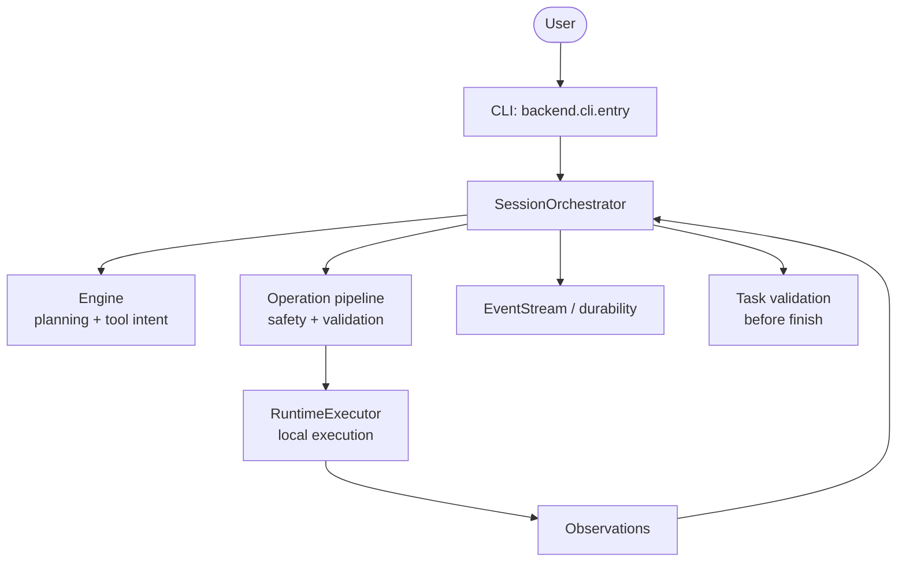

# Grinta


[](LICENSE)
[](https://python.org)
[](docs/INSTALL.md)
[](https://mypy-lang.org/)
[](https://github.com/psf/black)
[](https://github.com/josephsenior/Grinta-Coding-Agent/actions/workflows/py-tests.yml)
[](https://github.com/josephsenior/Grinta-Coding-Agent/actions/workflows/lint.yml)
[](https://github.com/josephsenior/Grinta-Coding-Agent/actions/workflows/e2e-tests.yml)

> **Local-first. Provider-agnostic. Ships with real LSP + DAP. ~1.4 MB wheel.**
>
> A CLI coding agent that plans, executes, validates, and finishes — without a cloud control plane, without lock-in to one model vendor, and without a 1.6 GB install.


## Why Grinta vs the rest

| | **Grinta** | Aider | Claude Code | Codex CLI |
|---|---|---|---|---|
| Install size (base wheel) | **1.4 MB** | ~80 MB | ~15 MB | ~12 MB |
| Provider-agnostic (OpenAI / Anthropic / Google / Ollama / LM Studio / OpenRouter) | ✅ | ✅ | ❌ Anthropic only | ❌ OpenAI only |
| Local-first (works fully offline w/ Ollama) | ✅ auto-detected | partial | ❌ | ❌ |
| LSP integration (auto-discovers 17 servers) | ✅ | ❌ | partial | ❌ |
| DAP debugger integration | ✅ auto-discovered | ❌ | ❌ | ❌ |
| Cost / token / latency HUD | ✅ live | partial | ❌ | partial |
| Stuck-loop + cost-acceleration detection | ✅ | ❌ | partial | ❌ |
| Risk-classified actions + audit log | ✅ `hardened_local` | ❌ | partial | partial |
| Session checkpoint / resume / revert | ✅ event-stream | ✅ git | partial | ❌ |
| Windows-first parity (PowerShell) | ✅ | partial | partial | partial |
| MCP support | ✅ | ❌ | ✅ best in class | partial |

The pitch in one sentence: **everything Aider's local-first ethos gives you, plus the depth of tooling Claude Code has, without locking you to a single model vendor.**

## Install in 30 seconds

```bash
pipx install grinta-ai          # lean install (~few MB) — all you need for coding
grinta init                     # one-time wizard: pick provider + paste key
grinta                          # launch the REPL in the current directory
```

Optional extras (install only what you need):

```bash
pipx install "grinta-ai[rag]"        # adds chromadb (~80MB ONNX model) for vector memory
pipx install "grinta-ai[documents]"  # adds PDF / DOCX / PPTX / LaTeX parsing
pipx install "grinta-ai[browser]"    # adds browser-use for web automation
pipx install "grinta-ai[all]"        # everything
```

That is the whole setup. The `grinta init` wizard auto-detects local Ollama and LM Studio servers and writes a working settings file for you. Installed runs use `~/.grinta/settings.json`; source checkouts use the repository `settings.json`; `APP_ROOT` can intentionally override that root. Other install paths (uv, Homebrew, Scoop, Docker) are in [docs/INSTALL.md](docs/INSTALL.md).

## What you get

- **Task completion, not just file edits.** Validation gates and stuck detection block premature "done".
- **Model-agnostic.** OpenAI, Anthropic, Google, OpenRouter, Ollama, LM Studio — same prompt surface, same tools.
- **Local-first.** Code stays in your workspace; sessions, checkpoints, and audit logs live under `~/.grinta/workspaces/<id>/storage`.
- **Strong safety rails.** Risk-classified actions, CRITICAL refusal gate, secret masking, and a session-wide audit trail.
- **Durable long sessions.** Event-stream ledger, automatic compaction, manual `/checkpoint`, and revert.
- **Lean TUI.** Cost / tokens / latency / breaker state visible in the HUD; rich slash commands (`/help`).

## Common slash commands

| Command       | What it does                                               |
| ------------- | ---------------------------------------------------------- |
| `/help`       | Full slash-command reference                               |
| `/cost`       | Tokens, calls, USD spent this session                      |
| `/diff`       | Workspace git changes (`--stat`, `--name-only`, `--patch`) |
| `/sessions`   | Recent sessions, with optional limit (`/sessions list 10`) |
| `/think`      | Toggle the optional reasoning scratchpad                   |
| `/checkpoint` | Snapshot the workspace (revertable)                        |
| `/status`     | Full HUD snapshot                                          |
| `/compact`    | Force context compaction now                               |

## Security boundary

Grinta executes actions on the local host. `hardened_local` adds stricter policy checks but **is not** sandboxing or process isolation. Read [docs/SECURITY_CHECKLIST.md](docs/SECURITY_CHECKLIST.md) **before pointing Grinta at code you do not trust** — for hostile codebases, run inside a VM or container.

## Architecture (high level)



See [docs/ARCHITECTURE.md](docs/ARCHITECTURE.md) for the deep dive.

Contributors: CI runs the full unit corpus on Linux and Windows ([docs/CI.md](docs/CI.md)); match that locally before opening a PR ([CONTRIBUTING.md](CONTRIBUTING.md#testing-before-a-pull-request)).

## The story behind Grinta

Grinta is a single-author project, written and rewritten in public. The journey — what was killed, what was wrong, what got rebuilt — lives in the **Book of Grinta**:

[`preface-why-this-story-matters.md`](preface-why-this-story-matters.md) → [`00-the-meaning-of-grinta.md`](00-the-meaning-of-grinta.md) → … → [`31-the-myth-of-the-committee.md`](31-the-myth-of-the-committee.md). Full index in [BOOK_OF_GRINTA.md](BOOK_OF_GRINTA.md).

## Quick start (from source)

### Windows (recommended)

```powershell
.\START_HERE.ps1
```

### Linux / macOS / manual

1. Install dependencies **in this repo’s environment only** (creates/updates `.venv/`; do not rely on a global `pip install` mixed with unrelated tools):

```bash
uv sync --group browser
```

Optional dev/test tools: `uv sync --group dev --group test --group browser`.

1. Create local settings:

```bash
uv run python -m backend.cli.entry init
```

1. Start the CLI:

```bash
uv run python -m backend.cli.entry
```

If you previously installed `grinta-ai` with `pip` into a **global** interpreter, remove it (`pip uninstall grinta-ai`) and use `uv run` from this repository so dependencies stay isolated.

### Docker (optional)

```bash
./docker_start.sh
```

Windows:

```powershell
.\DOCKER_START.ps1
```

## LLM Setup (`settings.json`)

When installed through `pipx`, Homebrew, or Scoop, settings are resolved from `~/.grinta/settings.json`. When running from a source checkout, settings resolve from the repository root unless `APP_ROOT` is set.

Minimal config:

```json
{
  "llm_provider": "openai",
  "llm_model": "openai/gpt-4o-mini",
  "llm_api_key": "${LLM_API_KEY}",
  "llm_base_url": ""
}
```

For manual setup, put the real value in a sibling `.env` file or your shell environment as `LLM_API_KEY`; avoid keeping the only copy of a secret directly in `settings.json`.

Common model ids:

- `openai/gpt-4o-mini`
- `anthropic/claude-sonnet-4-20250514`
- `google/gemini-2.5-pro`
- `ollama/llama3.2`

## Core Concepts

### Full task loop

Plan -> execute -> observe -> validate -> finish.

### Context compaction

Grinta uses compactor strategies to keep long sessions coherent under context limits.

### Reliability controls

Stuck detection, retry/recovery flows, and circuit breakers are built into orchestration.

### Completion integrity

Task validation can block finish calls when tracked work is incomplete.

## Documentation

- [User Guide](docs/USER_GUIDE.md)
- [Quick Start](docs/QUICK_START.md)
- [Troubleshooting](docs/TROUBLESHOOTING.md)
- [Support Matrix](docs/SUPPORT_MATRIX.md)
- [Architecture](docs/ARCHITECTURE.md)
- [Developer Guide](docs/DEVELOPER.md)
- [Vocabulary](docs/VOCABULARY.md)
- [The Book of Grinta](docs/journey/README.md)
- [Contributing](CONTRIBUTING.md)
- [Governance](GOVERNANCE.md)
- [Maintainers](MAINTAINERS.md)

## Contributing

See [CONTRIBUTING.md](CONTRIBUTING.md).

## License

MIT — see [LICENSE](LICENSE).

## Third-party Notices

Dependency attribution and notice policy: [THIRD_PARTY_NOTICES.md](THIRD_PARTY_NOTICES.md).
