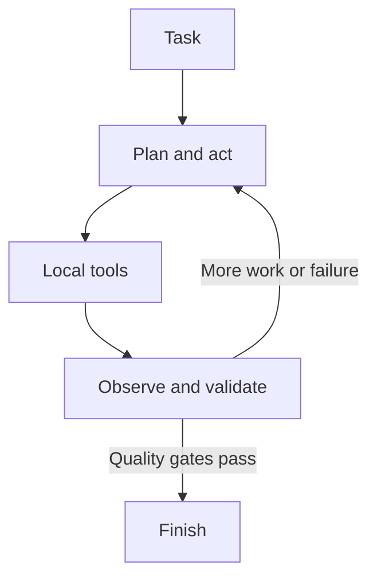

# Grinta

<p align="center">
  
</p>

### A local-first autonomous coding agent built to finish long, failure-prone software tasks.

[](https://github.com/josephsenior/Grinta-Coding-Agent/actions/workflows/py-tests.yml)
[](https://github.com/josephsenior/Grinta-Coding-Agent/actions/workflows/lint.yml)
[](https://python.org)
[](LICENSE)
[](docs/RELEASE_CHECKLIST.md)

**Demo recording:** published with the corresponding GitHub Release rather than stored in the source repository.

Grinta plans, edits, runs commands, debugs failures, validates the result, and continues until the task is finished. Its control plane and session state stay local; inference can use a major hosted provider or a local model.

[Install](#install) · [Documentation](docs/README.md) · [Architecture](docs/ARCHITECTURE.md) · [Showcase](SHOWCASE.md)

> **4h 33m autonomous run · 16,393 events · 373 tool outcomes · no additional user messages**
>
> [Inspect the sanitized execution report](docs/evidence/2026-07-09-autonomous-run-report.md)

## Why Grinta?

- Runs its control plane, execution, session history, and checkpoints locally
- Works across OpenAI, Anthropic, Google, OpenRouter, Ollama, and LM Studio
- Uses real Language Server Protocol (LSP) and Debug Adapter Protocol (DAP) integrations
- Recovers from provider failures, malformed tool calls, timeouts, and context pressure
- Keeps a durable event ledger, checkpoints, reverts, and inspectable audit trails
- Exposes Chat, Plan, and Agent workflows in a focused terminal UI

## Install

Install the stable version from PyPI or source:

```bash
git clone https://github.com/josephsenior/Grinta-Coding-Agent.git Grinta
cd Grinta
pipx install -e .
grinta
```

Or install directly from PyPI:

```bash
pipx install grinta
grinta
```

Optional integrations are available as `grinta[rag]`, `grinta[browser]`, or `grinta[all]`. See the [Quick Start](docs/QUICK_START.md) for Windows, WSL2, Linux, macOS, and provider setup.

## Showcase

| Long-horizon execution | Failure recovery | Raft key-value store |
| --- | --- | --- |
| Ran autonomously for **4h 33m**, processed **16,393 events**, and reached `FINISHED` through provider and runtime failures. | Read failing test output, isolated defects, edited the affected code, and reran validation without a follow-up prompt. | Built a Raft-backed key-value store, recovered from a race-condition failure, and finished with **39/39 tests passing**. |
| [Read the report](docs/showcase/autonomous-4h-session.md) | [Inspect the case study](docs/showcase/compilation-failure-recovery.md) | [Watch and inspect](docs/showcase/raft-kv-store.md) |

[Browse every case study →](SHOWCASE.md)

## How it works



The `SessionOrchestrator` coordinates model intent, the safety and validation pipeline, local execution, and observations. A durable event stream records the session while completion gates reduce premature “done” states. Read the [architecture guide](docs/ARCHITECTURE.md) for the full component map and [reliability guide](docs/RELIABILITY.md) for recovery behavior.

## Product philosophy

This table describes Grinta's design commitments—not an unverified performance ranking against other agents.

| Capability | Grinta |
| --- | :---: |
| Local control plane | Yes |
| Provider-agnostic inference | Yes |
| Local-model support | Yes |
| LSP integration | Yes |
| DAP debugging | Yes |
| Durable session ledger | Yes |
| Checkpoints and revert | Yes |
| Terminal UI | Yes |
| Cloud account required | No |

Grinta is designed for developers who value local execution, provider freedom, inspectable state, and recovery-oriented workflows that can survive long tasks.

## Safety boundary

Grinta runs commands with the privileges of the local user. Policy gates, secret masking, and optional process isolation reduce risk but do not make hostile code safe. Use a VM or container for untrusted repositories and read the [security checklist](docs/SECURITY_CHECKLIST.md) before increasing autonomy.

## Help build Grinta

Grinta is seeking contributors interested in:

- Agent reliability and recovery
- LSP and debugger integrations
- Local-model compatibility
- Terminal user interfaces
- Autonomous-agent evaluation

Start with a [`good-first-issue`](https://github.com/josephsenior/Grinta-Coding-Agent/issues?q=is%3Aissue+is%3Aopen+label%3Agood-first-issue) or read the [Contributor Map](docs/CONTRIBUTOR_MAP.md). The full development workflow is in [CONTRIBUTING.md](CONTRIBUTING.md).

## Documentation

- **Use Grinta:** [Quick Start](docs/QUICK_START.md) · [User Guide](docs/USER_GUIDE.md) · [Settings](docs/SETTINGS.md) · [Troubleshooting](docs/TROUBLESHOOTING.md)
- **Understand it:** [Architecture](docs/ARCHITECTURE.md) · [Reliability](docs/RELIABILITY.md) · [Support Matrix](docs/SUPPORT_MATRIX.md) · [Security](docs/SECURITY_CHECKLIST.md)
- **Contribute:** [Contributor Map](docs/CONTRIBUTOR_MAP.md) · [Developer Guide](docs/DEVELOPER.md) · [CI](docs/CI.md) · [Roadmap](ROADMAP.md)
- **Read the engineering story:** [The Book of Grinta](BOOK_OF_GRINTA.md)

Created and maintained by [Youssef Mejdi](https://github.com/josephsenior). Released under the [MIT License](LICENSE).
