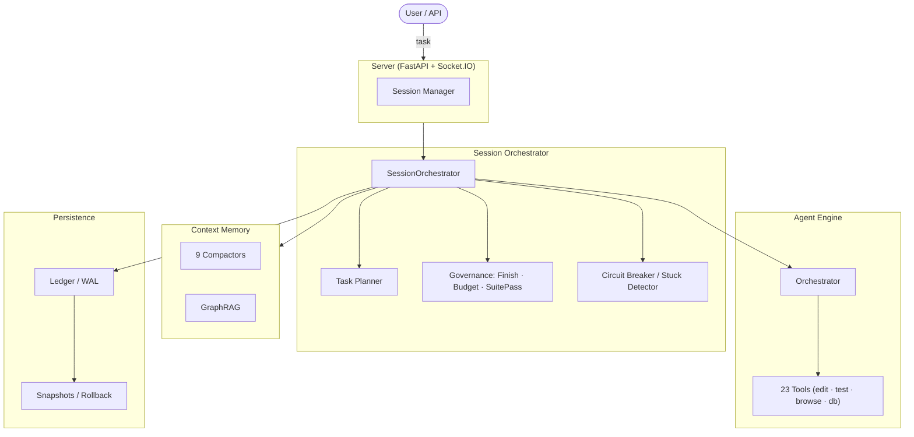

# Grinta

[](LICENSE)
[](https://python.org)
[](https://mypy-lang.org/)
[](https://github.com/psf/black)

> **Aider edits files. Grinta finishes tasks.**

**Grinta** is an open-source autonomous coding agent that plans, implements, tests, and validates work end-to-end — not just edits files and hands back control.

Give it a task like *"Add Stripe payment support"* and Grinta will: read the codebase, write a multi-step plan, implement the changes across files, run the tests, check the budget, and only declare done when everything checks out.

---

## Why Grinta?

Most AI coding tools stop at the file edit. Grinta keeps going:

- **Task Completion, Not File Edits:** A structured planner breaks work into steps and validates completion before declaring done. You get a finished task, not a pile of edits to review.
- **Self-Correcting:** If tests fail after an edit, Grinta detects it and tries again. If it gets stuck in a loop, a warning-first circuit breaker and a 10-heuristic stuck detector pause it for your review instead of silently burning your budget.
- **Built for Long Tasks:** Event-sourced session persistence, Write-Ahead Logging, and 9 live compactor implementations keep a 500-step session coherent instead of letting it drown in its own history.
- **Budget-Aware:** Per-task cost caps and inline cost tracking keep spend predictable — ideal for unattended overnight runs.
- **Safety First:** Per-action risk assessment, rollback checkpoints (no git required), and multi-trip circuit breakers before any destructive action.
- **Local-First:** Native Ollama and OpenAI-compatible support. Zero cloud required.

## Grinta Vocabulary

Grinta is standardizing on a distinct internal architecture language. The codebase
still contains older implementation names, but the canonical set is locked in
[docs/VOCABULARY.md](docs/VOCABULARY.md). The highest-signal mappings are:

- session orchestrator: currently `AgentController` or bare controller terminology
- operation: currently `Action`
- outcome: currently `Observation`
- record and ledger: currently `Event` and implemented by `EventStream`
- run: current backend session object
- run state: currently `State`
- snapshot: currently `Checkpoint`
- transcript: currently `Trajectory`
- runtime executor: currently `RuntimeExecutor`
- open operation: currently `PendingAction`
- execution policy: currently autonomy mode
- compactor: `Compactor` in code and `[compactor]` in persisted config
- context memory: currently `ContextMemory` and the generic memory layer
- operation pipeline: currently `ToolInvocationPipeline`
- governance: currently `Review`
- runtime, playbook, tool, core, security, telemetry, validation, and utils stay as they are

The goal is to make Grinta read like what it already is: a local-first execution
platform with durable run history, governed automation, and adaptive context
management.

## Security Boundary

Grinta currently runs actions on the local host. The `hardened_local` execution profile adds stricter local policy gates for commands, file access, workspace scoping, and interactive terminals, but it is not a sandbox and it is not process isolation.

Use Grinta as a trusted local agent for your own development workflows. Do not treat the current runtime as safe for hostile repositories or untrusted code.

---

## 🏗️ Architecture



See the [Architecture Deep Dive](docs/ARCHITECTURE.md) for a full walkthrough of the current implementation and the [Grinta Vocabulary](docs/VOCABULARY.md) for the naming contract.

---

## 🚀 Quick Start

### 🐳 Docker (Recommended)

Run the helper script to setup config and launch:

```bash
./docker_start.sh   # Linux/macOS
# or
.\DOCKER_START.ps1  # Windows
```

Default Docker flow starts the database-backed Grinta runtime stack.

Emergency fallback (file-backed mode):

```bash
./docker_start.sh --no-db
# or
.\DOCKER_START.ps1 -NoDatabase
```

### 🪟 Windows (Local)

Run the bootstrap script at the repository root. It installs dependencies, sets up the environment, and starts the app:

```powershell
.\START_HERE.ps1
```

### 🐧 Linux / macOS / Manual

1. **Prerequisites:** Python 3.12+ and [uv](https://docs.astral.sh/uv/).
2. **Install:** `uv sync`
3. **Setup Config:** `cp settings.template.json settings.json`
4. **Start:** `uv run python -m backend.cli.entry`

This is the canonical local startup path for the terminal CLI. If you specifically
need the raw HTTP backend for API or OpenAPI tooling, use [start_backend.ps1](start_backend.ps1)
on Windows or run `uv run python -m backend.execution.action_execution_server 3000 --working-dir "$PWD"`.

---

## 🤖 LLM Support

Grinta features an **Intelligent Provider Resolver** that handles routing, local discovery, and model aliases automatically.

### Cloud Models

Configure in `settings.json`. Grinta auto-resolves providers (OpenAI, Anthropic, Gemini, etc.):

- **Anthropic**: `claude-3-7-sonnet` (Native SDK, no prefix needed)
- **OpenAI**: `gpt-4o`, `gpt-4o-mini`
- **Google**: `gemini-2.0-pro-exp`

### Local Models & Auto-Discovery

Grinta automatically discovers running local providers (Ollama, LM Studio, vLLM):

1. Start your local provider (e.g., `ollama serve`).
2. Set `llm_model = "ollama/llama3.2"` (or `lmstudio/...`) in `settings.json`.
3. Grinta probes localhost ports (:11434, :1234, :8000) and routes locally with ZERO manual configuration.

### Model identifiers

Use the provider’s canonical model id in `llm_model` (and in LLM config), for example `ollama/llama3.2` or `claude-3-7-sonnet-20250219`. There is no separate alias map.

---

## 🛠️ Key Concepts

### The Full Task Loop

Grinta doesn't just edit files — it runs a complete loop: **plan → implement → test → validate → done**.

The orchestrator writes a structured plan, tracks step completion, and validates that a finish action is justified before ending the task. If tests fail, the task validation layer can reject the finish and send the agent back to fix things.

### Playbook Engine

Tasks can be codified as [Playbooks](docs/USER_GUIDE.md) — YAML files that define goals, constraints, and step templates. Grinta matches incoming requests to playbooks by keyword and semantic similarity, then executes the plan with full execution policy controls.

### 8 Context Compactors

Stop running out of tokens. Grinta uses specialized compactors to compress conversation history. The codebase and persisted config now both use `compactor` terminology throughout.

- **Smart/Auto**: Dynamically switches strategies based on task signals.
- **LLM Summary**: Uses a cheaper model to intelligently summarize history.
- **Observation Masking**: Keeps the event structure but hides bulky command outputs.
- **Semantic**: Uses heuristics to keep relevant past interactions without heavyweight models.

### 23 Specialized Tools

From `str_replace_editor` (tree-sitter aware) to `browser` automation and `database` access, the agent has everything it needs to build complex apps.

### 6-Strategy Stuck Detection

Grinta detects if the agent is looping by analyzing action patterns, semantic intent, cost acceleration, and token repetition. The circuit breaker then safely pauses the agent for your review.

### Rollback Without Git

`checkpoint` and `revert_to_safe_state` save per-file backups to `.grinta/checkpoints.json` — sub-commit granularity rollback that works even if the project has no git history.

---

## 📖 Documentation

- [User Guide](docs/USER_GUIDE.md) — LLM setup, execution policies, playbooks, and web UI usage.
- [Architecture](docs/ARCHITECTURE.md) — Deeper dive into the controller, events, and engine layers.
- [The Book of Grinta](docs/journey/README.md) — The full build journey, major pivots, removed systems, and architectural reasoning.
- [Vocabulary](docs/VOCABULARY.md) — Canonical Grinta terminology and package taxonomy.
- [Developer Guide](docs/DEVELOPER.md) — For contributors: project layout, internals, and patterns.
- [API Reference](openapi.json) — Full OpenAPI 3.1 spec for the backend.
- [Contributing](CONTRIBUTING.md) — How to add new tools, compactors, or features.

---

## 🤝 Contributing

We welcome contributions! See [CONTRIBUTING.md](CONTRIBUTING.md) for setup instructions and our architecture-first development workflow.

---

## ⚖️ License

MIT — See [LICENSE](LICENSE).
