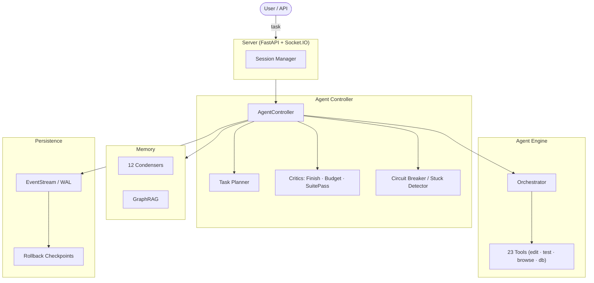

# Forge

[](LICENSE)
[](https://python.org)
[](https://mypy-lang.org/)
[](https://github.com/psf/black)

> **Aider edits files. Forge finishes tasks.**

**Forge** is an open-source autonomous coding agent that plans, implements, tests, and validates work end-to-end — not just edits files and hands back control.

Give it a task like *"Add Stripe payment support"* and Forge will: read the codebase, write a multi-step plan, implement the changes across files, run the tests, check the budget, and only declare done when everything checks out.

---

## Why Forge?

Most AI coding tools stop at the file edit. Forge keeps going:

- **Task Completion, Not File Edits:** A structured planner breaks work into steps; a critic system scores the result before declaring done. You get a finished task, not a pile of edits to review.
- **Self-Correcting:** If tests fail after an edit, Forge detects it and tries again. If it gets stuck in a loop, a 6-strategy circuit breaker pauses it for your review — not silently burns your budget.
- **Built for Long Tasks:** Event-sourced session persistence, Write-Ahead Logging, and 12 context condensers mean a 500-step session stays coherent as a 50-step one.
- **Budget-Aware:** Per-task cost caps and a `BudgetCritic` on every completion keep spend predictable — ideal for unattended overnight runs.
- **Safety First:** Per-action risk assessment, rollback checkpoints (no git required), and multi-trip circuit breakers before any destructive action.
- **Local-First:** Native Ollama and OpenAI-compatible support. Zero cloud required.

---

## 🏗️ Architecture



See the [Architecture Deep Dive](docs/ARCHITECTURE.md) for a full walkthrough of the 21 services and 23 tools.

---

## 🚀 Quick Start

### 🐳 Docker (Recommended)

Run the helper script to setup config and launch:

```bash
./docker_start.sh   # Linux/macOS
# or
.\DOCKER_START.ps1  # Windows
```

### 🪟 Windows (Local)

Run the bootstrap script at the repository root. It installs dependencies, sets up the environment, and starts the app:

```powershell
.\START_HERE.ps1
```

### 🐧 Linux / macOS / Manual

1. **Prerequisites:** Python 3.12+ and [uv](https://docs.astral.sh/uv/).
2. **Install:** `uv sync`
3. **Setup Config:** `cp settings.template.json settings.json`
4. **Start:** `uv run forge all`

---

## 🤖 LLM Support

Forge features an **Intelligent Provider Resolver** that handles routing, local discovery, and model aliases automatically.

### Cloud Models

Configure in `settings.json`. Forge auto-resolves providers (OpenAI, Anthropic, Gemini, etc.):

- **Anthropic**: `claude-3-7-sonnet` (Native SDK, no prefix needed)
- **OpenAI**: `gpt-4o`, `gpt-4o-mini`
- **Google**: `gemini-2.0-pro-exp`

### Local Models & Auto-Discovery

Forge automatically discovers running local providers (Ollama, LM Studio, vLLM):

1. Start your local provider (e.g., `ollama serve`).
2. Set `llm_model = "ollama/llama3.2"` (or `lmstudio/...`) in `settings.json`.
3. Forge probes localhost ports (:11434, :1234, :8000) and routes locally with ZERO manual configuration.

### Model identifiers

Use the provider’s canonical model id in `llm_model` (and in LLM config), for example `ollama/llama3.2` or `claude-3-7-sonnet-20250219`. There is no separate alias map.

---

## 🛠️ Key Concepts

### The Full Task Loop

Forge doesn't just edit files — it runs a complete loop: **plan → implement → test → review → done**.

The orchestrator writes a structured plan, tracks step completion, and before marking a task finished it runs three critics:

- **`AgentFinishedCritic`** — Did the agent actually emit a finish action, or did it wander off?
- **`SuitePassCritic`** — Do the tests for touched files still pass?
- **`BudgetCritic`** — Was the spend below the configured cap?

All three scores are logged at completion. If tests fail, the task validation layer can reject the finish and send the agent back to fix things.

### Playbook Engine

Tasks can be codified as [Playbooks](docs/USER_GUIDE.md) — YAML files that define goals, constraints, and step templates. Forge matches incoming requests to playbooks by keyword and semantic similarity, then executes the plan with full autonomy mode controls.

### 12 Context Condensers

Stop running out of tokens. Forge uses specialized "condensers" to compress conversation history:

- **Smart/Auto**: Dynamically switches strategies based on task signals.
- **LLM Summary**: Uses a cheaper model to intelligently summarize history.
- **Observation Masking**: Keeps the event structure but hides bulky command outputs.
- **Semantic**: Uses heuristics to keep relevant past interactions without heavyweight models.

### 23 Specialized Tools

From `str_replace_editor` (tree-sitter aware) to `browser` automation and `database` access, the agent has everything it needs to build complex apps.

### 6-Strategy Stuck Detection

Forge detects if the agent is looping by analyzing action patterns, semantic intent, cost acceleration, and token repetition. The circuit breaker then safely pauses the agent for your review.

### Rollback Without Git

`checkpoint` and `revert_to_safe_state` save per-file backups to `.forge/checkpoints.json` — sub-commit granularity rollback that works even if the project has no git history.

---

## 📖 Documentation

- [User Guide](docs/USER_GUIDE.md) — LLM setup, autonomy modes, playbooks, and web UI usage.
- [Architecture](docs/ARCHITECTURE.md) — Deeper dive into the controller, events, and engine layers.
- [Developer Guide](docs/DEVELOPER.md) — For contributors: project layout, internals, and patterns.
- [API Reference](openapi.json) — Full OpenAPI 3.1 spec for the backend.
- [Contributing](CONTRIBUTING.md) — How to add new tools, condensers, or features.

---

## 🤝 Contributing

We welcome contributions! See [CONTRIBUTING.md](CONTRIBUTING.md) for setup instructions and our architecture-first development workflow.

---

## ⚖️ License

MIT — See [LICENSE](LICENSE).
