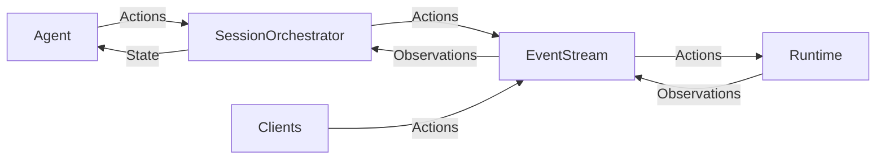

# Grinta Architecture

This directory contains the core components of Grinta.

This diagram provides an overview of the roles of each component and how they communicate and collaborate.


## Classes

The key classes in Grinta are:

- LLM: brokers all interactions with large language models. Works with any underlying completion model using direct SDK clients.
- Agent: responsible for looking at the current State and producing an Action that moves one step closer toward the end-goal.
- SessionOrchestrator: initializes the Agent, manages State, and drives the main loop that pushes the Agent forward, step by step.
- State: represents the current state of the Agent's task. Includes things like the current step, a history of recent events, the Agent's long-term plan, etc.
- EventStream: a central hub for events, where any component can publish events or listen for events published by other components.
  - Action: represents a request to e.g. edit a file, run a command, or send a message
  - Observation: represents information collected from the environment, e.g. file contents or command output
- Runtime: responsible for performing Actions and sending back Observations
  - Runtime Environment: the part of the runtime responsible for running commands in a local workspace with optional policy hardening
- Server: brokers Grinta runs over HTTP/WebSocket (web UI and API clients)
  - Session: holds a single EventStream, a single SessionOrchestrator, and a single Runtime.
  - ConversationManager: keeps a list of active sessions and ensures requests are routed to the correct Session

## Control Flow

Here's the basic loop (in pseudocode) that drives agents.

```python
while True:
  prompt = agent.generate_prompt(state)
  response = llm.completion(prompt)
  action = agent.parse_response(response)
  observation = runtime.run(action)
  state = state.update(action, observation)
```

In reality, most of this is achieved through message passing via the event stream.
The `EventStream` serves as the backbone for all communication in Grinta.



## Runtime

Please refer to the [documentation](https://docs.app.dev/usage/architecture/runtime) to learn more about `Runtime`.

Important: Grinta currently provides local policy hardening, not sandbox isolation. The `hardened_local` profile tightens workspace, command, file, and interactive-terminal behavior, but actions still run with host-user permissions.
