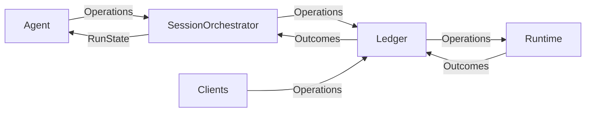

# Forge Architecture

This directory contains the core components of Forge.

This diagram provides an overview of the roles of each component and how they communicate and collaborate.


## Classes

The key classes in Forge are:

- LLM: brokers all interactions with large language models. Works with any underlying completion model using direct SDK clients.
- Agent: responsible for looking at the current RunState and producing an Operation that moves one step closer toward the end-goal.
- SessionOrchestrator: initializes the Agent, manages RunState, and drives the main loop that pushes the Agent forward, step by step.
- RunState: represents the current state of the Agent's task. Includes things like the current step, a history of recent records, the Agent's long-term plan, etc.
- Ledger: a central hub for Records, where any component can publish records, or listen for records published by other components. In the current codebase this role is implemented by `EventStream`.
  - Record: an Operation or Outcome
    - Operation: represents a request to e.g. edit a file, run a command, or send a message
    - Outcome: represents information collected from the environment, e.g. file contents or command output
- Runtime: responsible for performing Operations and sending back Outcomes
  - Runtime Environment: the part of the runtime responsible for running commands in a local workspace with optional policy hardening
- Server: brokers Forge runs over HTTP/WebSocket (web UI and API clients)
  - Run: holds a single Ledger, a single SessionOrchestrator, and a single Runtime. In the current codebase this role is implemented by `Session`.
  - ConversationManager: keeps a list of active runs and ensures requests are routed to the correct Run

## Control Flow

Here's the basic loop (in pseudocode) that drives agents.

```python
while True:
  prompt = agent.generate_prompt(state)
  response = llm.completion(prompt)
  operation = agent.parse_response(response)
  outcome = runtime.run(operation)
  state = state.update(operation, outcome)
```

In reality, most of this is achieved through message passing via the ledger.
The ledger (`EventStream` in the current implementation) serves as the backbone for all communication in Forge.



## Runtime

Please refer to the [documentation](https://docs.forge.dev/usage/architecture/runtime) to learn more about `Runtime`.

Important: Forge currently provides local policy hardening, not sandbox isolation. The `hardened_local` profile tightens workspace, command, file, and interactive-terminal behavior, but actions still run with host-user permissions.
